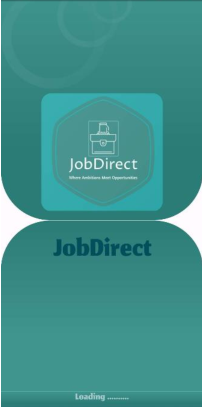

<h1 align="center">JobDirect</h1>

<h3 style="text-align: justify;">JobDirect is a mobile application designed to bridge the gap between job seekers and employers through an intuitive and user-friendly platform. It features virtual job fairs, interactive webinars, and comprehensive analytics to enhance the job search and hiring experience. The project follows Agile development methodologies, employing the Kanban framework to ensure continuous improvement and adaptability.</h3>

<p align="center">
  
</p>

---

## Figma Design:

<p align="center">
  
</p>

---

## Key Features:
- **Intuitive Job Search**: Easy-to-use interface for job seekers.
- **Virtual Engagement**: Job fairs and interactive webinars.
- **Comprehensive Analytics**: Data-driven insights for better decision-making.
- **Free and Accessible**: No-cost registration for job seekers.
- **Advanced Applicant Tracking**: Employers can efficiently manage job postings and applicants.
- **Career Resources**: Blogs, survey reports, and career development tips.
- **Agile Development**: Continuous improvement based on user feedback.
  
---

## App Demonstration & Overview:

Feel free to watch a demonstration of the app by clicking 👉<a href="https://drive.google.com/file/d/1cCgtaoOfrExii2tKMaNrC626fTNucX2Y/view?usp=sharing"> here </a>

---

## Running the Code:

To get started with JobDirect, follow these steps:

1. Clone the repository:
   ```bash
   git clone https://github.com/YourUsername/JobDirect.git
   ```
2. Install Dependencies:
   ```bash
   flutter pub get
   ```
3. Run the App:
   ```bash
   flutter run
   ```
   
---

## Requirements:
1. Flutter SDK 3.13.9
2. Dart SDK 3.1.5
3. Firebase Account (for authentication and data storage)
   
---

## Project Structure:
<pre>
JobDirect/
├── assets/                       # App assets (images, icons, fonts, figma designs, etc.)
│   ├── fonts/                    # UI elements and app-related fonts
│   ├── images/                   # UI elements and app-related images
│
├── lib/                          # Main source code directory
│   ├── providers/                # State management providers
│   │   ├── user_provider.dart
│   ├── screens/                  # UI and app-related screens
│   │   ├── authenticate/
│   │   │   ├── forgot_password.dart
│   │   │   ├── register.dart
│   │   │   ├── sign_in.dart
│   │   │   ├── toggle_auth.dart
│   │   ├── home/
│   │   │   ├── apply_job.dart
│   │   │   ├── dashboard_screen.dart
│   │   │   ├── profile_config_screen.dart
│   │   │   ├── splash_screen.dart
│   │   │   ├── terms_conditions_screen.dart
│   │   │   ├── upload_job_screen.dart
│   │   ├── shared/
│   │   │   ├── loading_animation.dart
│   │   ├── widget/
│   │   │   ├── bottom_nav_bar.dart
│   │   │   ├── comments_widget.dart
│   │   │   ├── job_list_widget.dart
│   │   │   ├── jobcards.dart
│   │   ├── services/
│   │   │   ├── global_methods.dart
│   │   │   ├── global_variables.dart
│   │   ├── utility/
│   │   │   ├── user_utility.dart
│   │   │   ├── firebase_options.dart
│   ├── main.dart                  # Entry point of the Flutter application
│   ├── wrapper.dart                # Handles authentication flow
│
└── pubspec.yaml                    # Flutter dependencies and project configuration
</pre>

